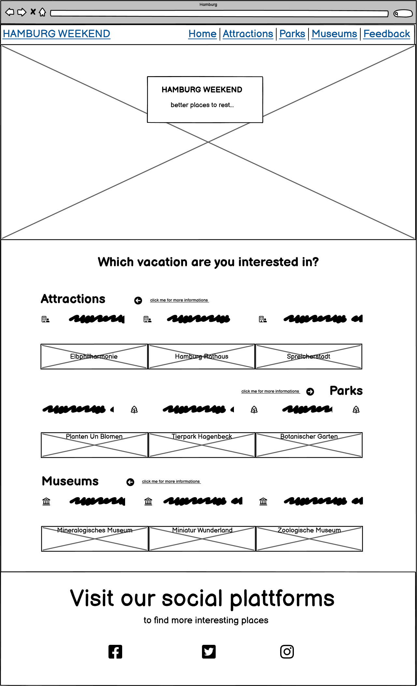
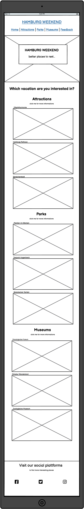
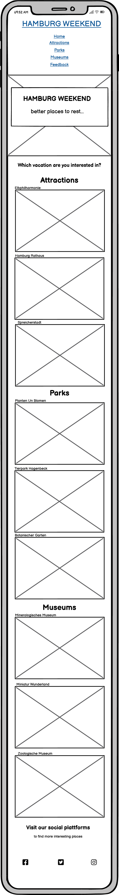

# Hamburg Weekend
(Developer: Bilan Mykhaylo)

[Live webpage](https://belan-mihail.github.io/hamburg-weekend/index.html)

## Table of Content

1. [Project Goals](#project-goals)
    1. [User Goals](#user-goals)
    2. [Site Owner Goals](#site-owner-goals)
2. [User Experience](#user-experience)
    1. [Target Audience](#target-audience)
    2. [User Requrements and Expectations](#user-requrements-and-expectations)
    3. [User Stories](#user-stories)
3. [Design](#design)
    1. [Design Choices](#design-choices)
    2. [Colour](#colours)
    3. [Fonts](#fonts)
    4. [Structure](#structure)
    5. [Wireframes](#wireframes)
4. [Technologies Used](#technologies-used)
    1. [Languages](#languages)
    2. [Frameworks & Tools](#frameworks-&-tools)
5. [Features](#features)
6. [Testing](#validation)
    1. [HTML Validation](#HTML-validation)
    2. [CSS Validation](#CSS-validation)
    3. [Accessibility](#accessibility)
    4. [Performance](#performance)
    5. [Device testing](#performing-tests-on-various-devices)
    6. [Browser compatibility](#browser-compatability)
    7. [Testing user stories](#testing-user-stories)
8. [Bugs](#Bugs)
9. [Deployment](#deployment)
10. [Credits](#credits)
11. [Acknowledgements](#acknowledgements)

### User Stories

- As a user of the site, I want to get information about various attractions and places to rest in Hamburg in order to choose an interesting place for himself to visit.

    - **Expected result:** the site has information about various attractions and places to rest in Hamburg.
    
    - **How to reach:** posting on a website about various sights and places to rest in Hamburg

    - **Achievement Criteria:** information about more than 6 sights or places to rest in Hamburg is available.

- As a user of the site, I want to get a visual idea of the attractions and places to rest in Hamburg (by viewing photos of these places) in order to choose an interesting place to visit.

    - **Expected result:** while on the site, the user receives a visual representation of the attractions and places to rest in Hamburg.
    
    - **How to reach:** placement on the site of photographs of attractions and places to rest in Hamburg.

    - **Achievement Criteria:** there are more than 3 photos of every attraction or places to rest in Hamburg listed on the site.

- As a user of the site, I want to get a brief description of the attractions and places to rest in Hamburg that I can visit in order to choose an interesting place to visit.

    - **Expected result:** the user, being on the site, has the opportunity to read a brief description of the attractions or places to rest in Hamburg.
    
    - **How to reach:** placement on the site of short descriptions of each attractions or/and places to rest in Hamburg.

    - **Achievement Criteria:** there is a one-time brief description of each attraction or each place for a rest in Hamburg that is listed on the site.

- As a user of the site, I want to get the opportunity to get more detailed information about the attractions and places to rest in Hamburg in order to choose an interesting place to visit.

    - **Expected result:** being on the site, the user has the opportunity to get acquainted with more detailed information about the atrractions or/and about places to rest in Hamburg than provided on the site.
    
    - **How to reach:** placement under each object of a link to the main site or resource with more detailed information about the object.

    - **Achievement Criteria:** each attraction or each place of rest has one link to the official website or resource containing more detailed information.

- As a user of the site, I want to receive information about the addresses of attractions or places to rest in Hamburg in order to be able to get to the object.

    - **Expected result:** being on the site, the user has the opportunity to get acquainted with the address of the object and see it on the map of Hamburg.
    
    - **How to reach:** placement under each object of information about the address of the object and a link to a Google map.

    - **Achievement Criteria:** each object has information about the address of the object and a link to the object on the Google map.

- As a user of the site, I want to get the opportunity to send a feedback to the website adminastraitions. 

    - **Expected result:** being on the site, the user has the opportunity to send a feedback to the website adminastraitions.
    
    - **How to reach:** creating a feedback section (page) with a feedback form.

    - **Achievement Criteria:** the site should have a separate page for feedback with a feedback form.

### Wireframes

Home

**Ipad version**

**Mobile Version**

## Features

 - ### Navigation

   - This section is located at the top of the page. On the left is the site logo, which is a link to the home page. To the right about other navigation links (houses, sights, parks, museums, feedback) that are indicated on various pages of the site.

   - This section is duplicated on all pages of the site so that the user can easily navigate through the pages of the site without using the "back" button.

   - This section has a color that contrasts with the background. The capital letters of the logo have an individual eye-catching color and a larger size.

   - for the convenience of the user, the active page of the site is underlined with an orange line. Other navigation links become underlined with a green line on hover.

   ------