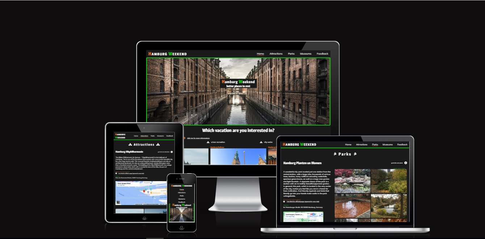
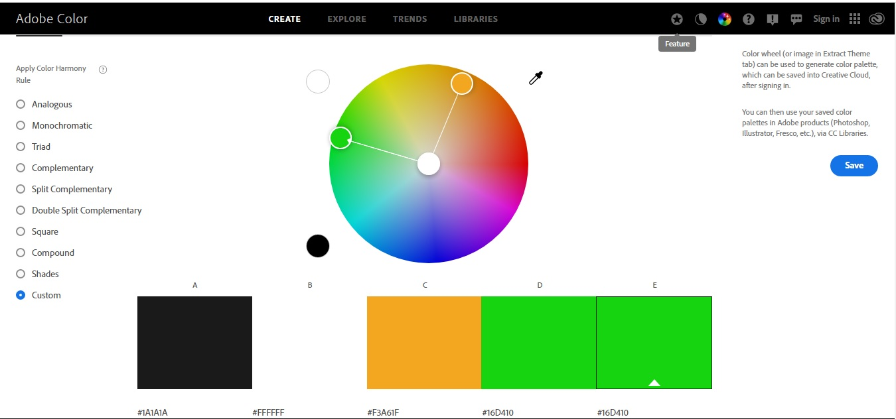
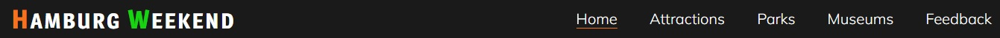
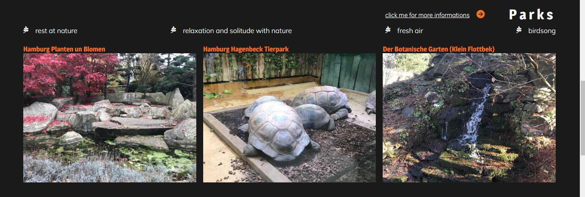
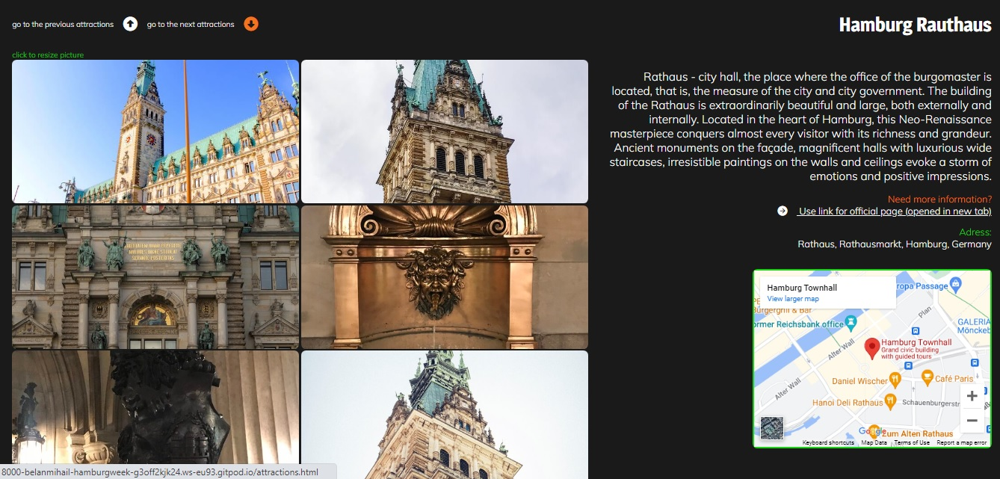
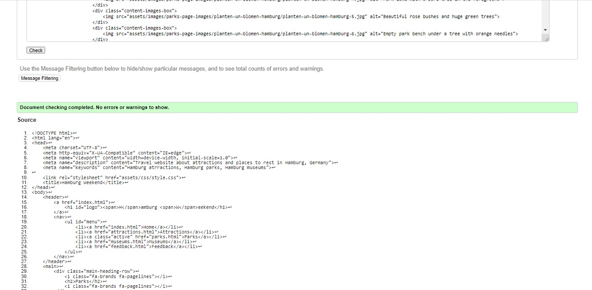
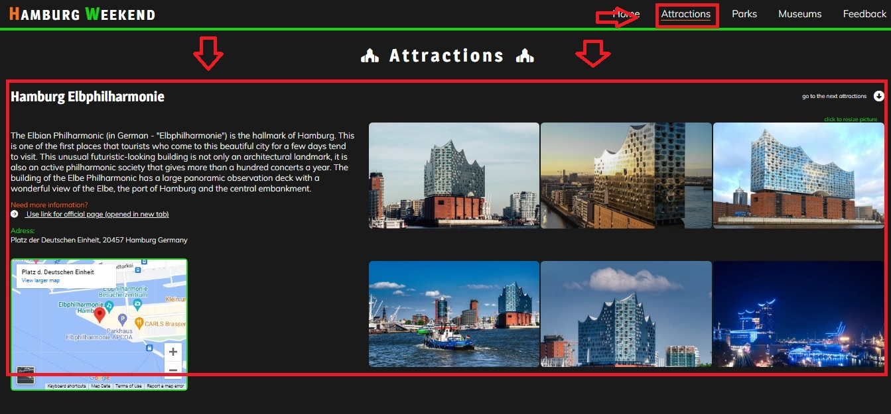

# Hamburg Weekend
(Developer: Bilan Mykhaylo)

[Live webpage](https://belan-mihail.github.io/hamburg-weekend/index.html)

## Table of Content

1. [Project Goals](#project-goals)
    1. [User Goals](#user-goals)
    2. [Site Owner Goals](#site-owner-goals)
2. [User Experience](#user-experience)
    1. [Target Audience](#target-audience)
    2. [User Requrements and Expectations](#user-requrements-and-expectations)
    3. [User Stories](#user-stories)
3. [Design](#design)
    1. [Design Choices](#design-choices)
    2. [Colour](#colours)
    3. [Fonts](#fonts)
    4. [Structure](#structure)
    5. [Wireframes](#wireframes)
4. [Technologies Used](#technologies-used)
    1. [Languages](#languages)
    2. [Frameworks & Tools](#frameworks-&-tools)
5. [Features](#features)
    1. [Logo and Navigation](#logo-and-navigation)
    2. [Hero section](#hero-section)
    3. [Places section](#places-section)
    4. [Footer](#footer)
    5. [Attractions](#attractions)
    6. [Parks](#parks)
    7. [Museums](#museums)
    8. [Feedback](#feedback)
6. [Testing](#validation)
    1. [HTML Validation](#HTML-validation)
    2. [CSS Validation](#CSS-validation)
    3. [Accessibility](#accessibility)
    4. [Performance](#performance)
    5. [Device testing](#performing-tests-on-various-devices)
    6. [Browser compatibility](#browser-compatability)
    7. [Testing user stories](#testing-user-stories)
8. [Bugs](#Bugs)
9. [Deployment](#deployment)
10. [Credits](#credits)
11. [Acknowledgements](#acknowledgements)

## Project Goals

### User Goals

  - Learn about Hamburg attractions and other interesting places to visit;
  - See photos of Hamburg attractions and other interesting places to visit;
  - Find out about the location of Hamburg attractions and other interesting places to visit;

### Site Owner Goals

  - Increase in the number of guests;
  - Providing information of interest to visitors;
  - Getting positive feedback from site users;

## User Experience

### Target Audience

  - Single tourists who came to Hamburg;
  - Small tourist groups came to Hamburg;
  - People who came for a few days on a business trip to Hamburg;
  - Refugees and other people who have recently arrived in Hamburg;

### User Requrements and Expectations

  - Simple and user-friendly website design;
  - Thematic division of content;
  - Convenient navigation menu and additional buttons for moving from object to object;
  - Visualization of the object
  - Each object has links to the official page or a page with more detailed information about the object;
  - Availability of information about the location of the object.

### User Stories

- As a user of the site, I want to get information about various attractions and places to rest in Hamburg in order to choose an interesting place for himself to visit.

    - **Expected result:** the site has information about various attractions and places to rest in Hamburg.
    
    - **How to reach:** posting on a website about various sights and places to rest in Hamburg

    - **Achievement Criteria:** information about more than 6 sights or places to rest in Hamburg is available.

- As a user of the site, I want to get a visual idea of the attractions and places to rest in Hamburg (by viewing photos of these places) in order to choose an interesting place to visit.

    - **Expected result:** while on the site, the user receives a visual representation of the attractions and places to rest in Hamburg.
    
    - **How to reach:** placement on the site of photographs of attractions and places to rest in Hamburg.

    - **Achievement Criteria:** there are more than 3 photos of every attraction or places to rest in Hamburg listed on the site.

- As a user of the site, I want to get a brief description of the attractions and places to rest in Hamburg that I can visit in order to choose an interesting place to visit.

    - **Expected result:** the user, being on the site, has the opportunity to read a brief description of the attractions or places to rest in Hamburg.
    
    - **How to reach:** placement on the site of short descriptions of each attractions or/and places to rest in Hamburg.

    - **Achievement Criteria:** there is a one-time brief description of each attraction or each place for a rest in Hamburg that is listed on the site.

- As a user of the site, I want to get the opportunity to get more detailed information about the attractions and places to rest in Hamburg in order to choose an interesting place to visit.

    - **Expected result:** being on the site, the user has the opportunity to get acquainted with more detailed information about the atrractions or/and about places to rest in Hamburg than provided on the site.
    
    - **How to reach:** placement under each object of a link to the main site or resource with more detailed information about the object.

    - **Achievement Criteria:** each attraction or each place of rest has one link to the official website or resource containing more detailed information.

- As a user of the site, I want to receive information about the addresses of attractions or places to rest in Hamburg in order to be able to get to the object.

    - **Expected result:** being on the site, the user has the opportunity to get acquainted with the address of the object and see it on the map of Hamburg.
    
    - **How to reach:** placement under each object of information about the address of the object and a link to a Google map.

    - **Achievement Criteria:** each object has information about the address of the object and a link to the object on the Google map.

- As a user of the site, I want to get the opportunity to send a feedback to the website adminastraitions. 

    - **Expected result:** being on the site, the user has the opportunity to send a feedback to the website adminastraitions.
    
    - **How to reach:** creating a feedback section (page) with a feedback form.

    - **Achievement Criteria:** the site should have a separate page for feedback with a feedback form.

### Site Owner Stories

- As a owner of the site, i want:

    - Increase in the number of guests;
    - Providing users of the site with information of interest to them;
    - Getting positive feedback from site users; 

## Design

### Design Choices

The site is designed to maximize the interest of users and provide them with brief but meaningful information about the objects of interest to them. The main focus should be on providing the user with more visual information about sights and places for recreation, as well as on the convenience of the user in moving around the site.

### Colors

For the text content on the site, a white color was chosen, which contrasts well with the dark background of the site. Green and orange were chosen for the accent as well as for the hover effects. The text content in the photo was overlaid with an orange accent. I used Adobe Color to select the color.

Screenshot (Adobe Color)

### Fonts

For plain text, the Mulish font is used, connected using google fonts. For headings, Magra font was used with more bold fonts. Used fonts are well combined with each other

### Structure

The page is structured in a well know and user friendly. Upon arriving to the website the user sees a familiar type of navigation bar with the logo on the left side and the navigation links to the right. The website consists of five separate pages:

- **Home Page:** contains a navigation menu in the header, a hero section with a title explaining the essence of the site and a photo corresponding to the topic of the site, a place section with photos and descriptions of possible vacation spots, as well as a footer with links-icons to social networks;

- **Attractions Page:** contains a navigation menu in the header, three articles with a description, photos, coordinates one of the Hamburg attractions and a link to the official page, as well as a footer with links-icons to social networks;

- **Parks Page:** contains a navigation menu in the header, three articles with a description, photos, coordinates one of the Hamburg parks and a link to the official page, as well as a footer with links-icons to social networks;

- **Museums Page:** contains a navigation menu in the header, three articles with a description, photos, coordinates one of the Hamburg museums and a link to the official page, as well as a footer with links-icons to social networks;

- **Feedback Page:** contains a navigation menu in the header, a section with a feedback form, as well as a footer with links-icons to social networks.

### Wireframes

Home Page Wireframes

Home Page Fullscreen

Home Page Ipad

Home Page Mobile

Attraction Page Wireframes

Attraction Page Fullscreen

Attraction Page Ipad

Attraction Page Mobile

Parks Page Wireframes

Park Page Fullscreen

Park Page Ipad

Park Page Mobile

Museum Page Wireframes

Museum Page Fullscreen

Museum Page Ipad

Museum Page Mobile

Feedback Page Wireframes

Feedback Page Fullscreen

Feedback Page Ipad

Feedback Page Mobile

## Technologies Used

### Languages

- HTML;
- CSS;

### Frameworks & Tools

- **Balsamiq.** Used to create the skeleton of the project; 

- **Google Fonts.** Used to connect fonts to the project;

- **Adobe Color.** Used to select colors; 

- **Font Awsome.** Used to place icons on project pages;

- **Git.** Used for version control;

- **GitHub.** Used to store the project code after being pushed from Git;

- **Gitpod.** Used to write html and css project code;

- **Paint.NET.** Used to process screenshots and pictures.

- **Google Maps** used to embed maps on the site.

## Features

 - ### Logo and Navigation

   - This section is located at the top of the page. On the left is the site logo, which is a link to the home page. To the right about other navigation links (home, attractions, parks, museums, feedback) that are indicated on various pages of the site.

   - This section is duplicated on all pages of the site so that the user can easily navigate through the pages of the site without using the "back" button.

   - This section has a color that contrasts with the background. The capital letters of the logo have an individual eye-catching color and a larger size.

   - for the convenience of the user, the active page of the site is underlined with an orange line. Other navigation links become underlined with a green line on hover.

  

  ----

  ### Hero-section

- This section is located only on the home page, immediately below the navigation menu.

- Instead of a section background, a thematic picture is used that corresponds to the main theme of the site.

- The title, which provides the user with a complete understanding of the subject of the site, is located on the orange "carpet" for contrast with the background image.

------

### Places section

- This section is located only on the home page, immediately below hero-section.

- The section demonstrates the main attractions and places for rest in Hamburg, which information is contained on other - thematic pages of the site.

- Images of attractions, parks and museums are links, when clicked, the user moves to the corresponding thematic section. On hover, the images increase in size, which creates a positive reaction to the user's actions.

- The section is decorated with thematic icons and additional links with hover effect.

- To create a positive visual effect, the paired thematic block of the section has a reverse order of the text content.

------

### Footer

- This section is located at the bottom of the page. in the middle, in a large, well-readable font, there is a title calling for action - visiting the social pages of the site. Below, under the heading, there are icons depicting the corresponding social networks, which are links.

- This section is duplicated on all pages of the site.

- When hovering over icons, a hover effect is triggered for greater user interaction. When pressed, a new color appears for even more user interaction.

- The color of the text and icons contrasts well with the background of the section.

- A green stripe of one of the site's accent colors additionally separates the section from the neighboring section.

------

### Attractions 

- Thematic page dedicated to the attractions of Hamburg. Starts with a large font title.

- Conditionally the page is divided into three articles, each of which is devoted to one attraction of Hamburg.

- Each article about the attraction is divided into two sides: the left side contains the name of the attraction, a short description, a link to the official website, an address and a map with the location of the object; the right side contains photos of the object.

- To create a beautiful visual effect, each paired block (articles) has a reverse order of elements.

- Articles are decorated with thematic links, and also interact with the user using the hover effect on the links and on the name of the object.

- For the convenience of moving from object to object, each article (depending on its position on the page) has arrow icons that are internal links for moving to the next / previous object, which saves the user from having to scroll the page while reading.

- when you click on any image and hold it, the height of the image becomes 100%, which allows the user to see the entire image and get a better idea of the object.

------

### Parks

- Thematic page dedicated to the parks of Hamburg. Starts with a large font title.

- Conditionally the page is divided into three articles, each of which is devoted to one park of Hamburg.

- Each article about the park is divided into two sides: the left side contains the name of the park, a short description, a link to the official website, an address and a map with the location of the object; the right side contains photos of the object.

- To create a beautiful visual effect, each paired block (articles) has a reverse order of elements.

- Articles are decorated with thematic links, and also interact with the user using the hover effect on the links and on the name of the object.

- For the convenience of moving from object to object, each article (depending on its position on the page) has arrow icons that are internal links for moving to the next / previous object, which saves the user from having to scroll the page while reading.

- when you click on any image and hold it, the height of the image becomes 100%, which allows the user to see the entire image and get a better idea of the object.

------

### Museums

- Thematic page dedicated to the museums of Hamburg. Starts with a large font title.

- Conditionally the page is divided into three articles, each of which is devoted to one museum of Hamburg.

- Each article about the museum is divided into two sides: the left side contains the name of the museum, a short description, a link to the official website, an address and a map with the location of the object; the right side contains photos of the object.

- To create a beautiful visual effect, each paired block (articles) has a reverse order of elements.

- Articles are decorated with thematic links, and also interact with the user using the hover effect on the links and on the name of the object.

- For the convenience of moving from object to object, each article (depending on its position on the page) has arrow icons that are internal links for moving to the next / previous object, which saves the user from having to scroll the page while reading.

- when you click on any image and hold it, the height of the image becomes 100%, which allows the user to see the entire image and get a better idea of the object.

------

### Feedback

- This section is located only on the feedback page, immediately below navigation bar.

- Instead of a section background, a thematic picture is used that corresponds to the main theme of the site.

- The feedback form is located on the orange "carpet" for contrast with the background image.

- The feedback form is consisted from name input block, email input block and textarea block for users feedback. Below is the submit button.

- To be more responsive to user actions, mouseover input forms get green borders, and the button changes color tint and becomes larger.

- For the convenience of the user, the input fields contain a placeholder text.

------

## Testing

### HTML Validation

The W3C Markup Validation Service was used to validate the HTML of the website. All pages pass with no errors no warnings to show.

Home

Attractions

Parks

Museums

Feedback

### CSS Validation

W3C Jigsaw CSS Validation Service was used to validate CSS

style.css

### Accessibility

Accessibility testing was carried out using the WAVE WebAIM service. No contrast errors were found. On the page attractions, parks and museums, 4 errors of the same type (Empty link) were found regarding icon links for switching between page objects, however, the description of the purpose of these links is made in separate paragraphs in order to make it easier to manage elements - and therefore errors do not actually exist.

Home

Attractions

Parks

Museums

Feedback

### Performance

Google Lighthouse in Google Chrome Developer Tools was used to test the performance of the website.

Home

Attractions

Parks

Museums

Feedback

### Device testing

The website was tested on the following devices:

   - Iphone 7;
   - Iphone 12 Pro;

In addition, the website was tested using Google Chrome Developer Tools Device Toggeling option for all available device options.

### Browser compatibility

The website was tested on the following browsers:

   - Google Chrome;
   - Yandex Browser;
   - Mozilla Firefox;

### Testing User Stories

1. As a user of the site, I want to get information about various attractions and places to rest in Hamburg in order to choose an interesting place for himself to visit.

 **Action** | **Result** 
 -----------| ----------  
 1.Being on the home page, scroll to the second section | Find interesting places 
 2.Navigate to the Attractions Page |  Find interesting places
 3.Navigate to the Parks Page |  Find interesting places
 4.Navigate to the Museums Page |  Find interesting places

Screenshot evidences

the size of the site is deliberately reduced to provide evidence

since the pages of attractions, parks, museums are identical in structure, a screenshot from one page is shown as evidence

 

----

2. As a user of the site, I want to get a visual idea of the attractions and places to rest in Hamburg (by viewing photos of these places) in order to choose an interesting place to visit.

 **Action** | **Result** 
 -----------| ----------  
 1.Being on the home page, scroll to the second section | Find a photo of attractions and points of interest 
 2.Navigate to the Attractions Page and scroll down |  Find a photo of of the attractions in Hamburg
 3.Navigate to the Parks Page and scroll down |  Find a photo of the parks in Hamburg
 4.Navigate to the Museums Page and scroll down |  Find a photo of the museums in Hamburg

Screenshot evidences

the size of the site is deliberately reduced to provide evidence

since the pages of attractions, parks, museums are identical in structure, a screenshot from one page is shown as evidence

 

---

3. As a user of the site, I want to get a brief description of the attractions and places to rest in Hamburg that I can visit in order to choose an interesting place to visit.

**Action** | **Result** 
 -----------| ----------  
 1.Navigate to the Attractions Page and scroll down |  Find a brief description of attractions in Hamburg
 2.Navigate to the Parks Page and scroll down |  Find a brief description of parks in Hamburg
 3.Navigate to the Museums Page and scroll down |  Find a brief description of museums in Hamburg

 

Screenshot evidences

since the pages of attractions, parks, museums are identical in structure, a screenshot from one page is shown as evidence

 

----

4. As a user of the site, I want to get the opportunity to get more detailed information about the attractions and places to rest in Hamburg in order to choose an interesting place to visit.

**Action** | **Result** 
 -----------| ----------  
 1.Navigate to the Attractions Page and scroll down (after descriptions) |  Find a link to the official pages or pages with more information about attractions in Hamburg
 2.Navigate to the Parks Page and scroll down (after descriptions) |  Find a link to the official pages or pages with more information about parks in Hamburg
 3.Navigate to the Museums Page  and scroll down (after descriptions)|  Find a link to the official pages or pages with more information about museums in Hamburg

 

Screenshot evidences

since the pages of attractions, parks, museums are identical in structure, a screenshot from one page is shown as evidence

 

---

5. As a user of the site, I want to receive information about the addresses of attractions or places to rest in Hamburg in order to be able to get to the object.

**Action** | **Result** 
 -----------| ----------  
 1.Navigate to the Attractions Page and scroll down (after officail links) |  Find a information about the addresses of attractions in Hamburg and Google Map
 2.Navigate to the Parks Page and scroll down (after officail links) |  Find a information about the addresses of parks in Hamburg and Google Map.
 3.Navigate to the Museums Page  and scroll down (after officail links)|  Find a information about the addresses of museums in Hamburg and Google Map.

 

Screenshot evidences

since the pages of attractions, parks, museums are identical in structure, a screenshot from one page is shown as evidence

 

---

6. As a user of the site, I want to get the opportunity to send a feedback to the website adminastraitions. 

**Action** | **Result** 
 -----------| ----------  
 1.Navigate to the Feedback Page and scroll down. Then fill the feedback form and press "Send"|  You can send feedback

 

Screenshot evidences

 

## Bugs

  - Accessibility check showed insufficient contrast of the colors used on the site. Contrast level was 42%

    **Actions**: site color scheme has been changed;

    **Result**: contrast level increased to 100%;

    **Status**: bug fixed;

- The spelling of the words "Hamburg Weekend" in the hero section was different from the spelling of the words "Hamburg Weekend" in the logo. Capital letters did not have accent colors

    **Actions**: add styles to the first letters of of the words "Hamburg Weekend" in the hero section;

    **Result**: The spelling of the words "Hamburg Weekend" in the hero section has become identical to the spelling of the words "Hamburg Weekend" in the logo;

    **Status**: bug fixed;

- The peace sign icon in the feedback form did not have a hover effect and did not change color to a green accent color.

    **Actions**: add styles to the icons in the feedback form;

    **Result**: The icon with the world sign in the feedback form has received a hover effect and changes its accent color to green on hover

    **Status**: bug fixed;

## Deployment

The website was deployed using GitHub Pages by following these steps:

1. In the GitHub repository navigate to the Settings tab
2. On the left hand menu select Pages
For the source select Branch: master
3. After the website completed automaticaly you will be a ribbon on the top saying: "Your site is published at https://belan-mihail.github.io/hamburg-weekend/"

The live link can be found here - [Hamburg Weekend](https://belan-mihail.github.io/hamburg-weekend/index.html)

## Credits

### Content 

**Text content** including descriptions of various objects are owned by the developer.

**The fonts** used on the pages were connected from the site - [Google Fonts](https://fonts.google.com/)

**The Maps** were taken from the site - [Google Maps](https://www.google.com.hk/maps/)

The icons used on the site were taken from the site - [Font Awesome](https://fontawesome.com/)

### Media

The media content of the home page, the feedback page, as well as the media content from all the objects listed on the attraction page was taken from the site - [Pixabay](https://pixabay.com/)

## Acknowledgements

I would like to express my sincere gratitude:

  - My mentor Mo Shami for his advice and support.
  - My daughter Alice for always giving me inspiration and strength to go forward.

